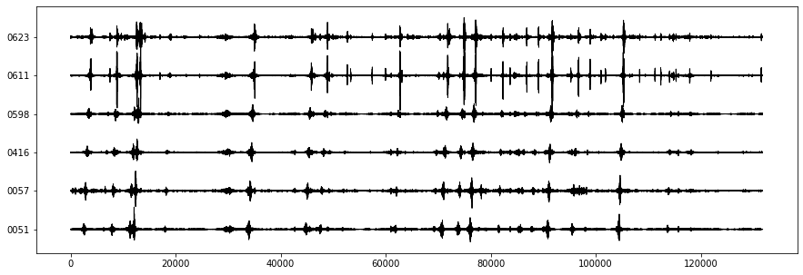
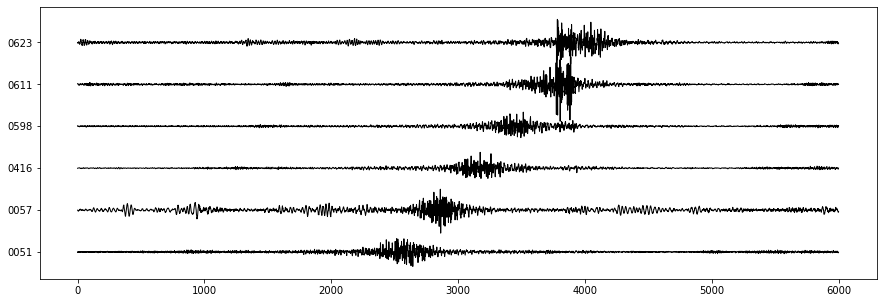
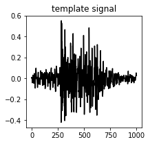
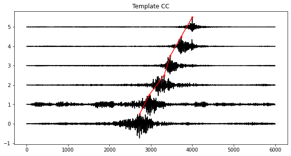
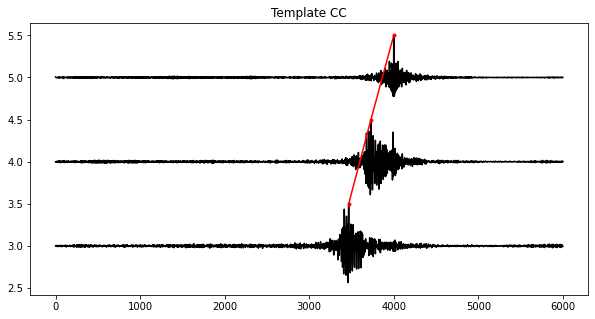

# 机场高速数据测试简单处理 
### 采集时间：2022年8月31日下午
### 实验设计：6台仪器线性排布，间距20m,总长100m


```python
import os
import obspy
from obspy import read,UTCDateTime
import matplotlib.pyplot as plt
import numpy as np

data_dir = 'data'
st = obspy.Stream()
for sacname in os.listdir(data_dir):
    st = st + read(os.path.join(data_dir,sacname))
st.filter('bandpass', freqmin=5, freqmax=120)
```


    6 Trace(s) in Stream:
    .EA000051..EHZ | 2022-08-31T09:40:00.000000Z - 2022-08-31T09:59:59.996073Z | 250.0 Hz, 300000 samples
    .EA000057..EHZ | 2022-08-31T09:40:00.000000Z - 2022-08-31T09:59:59.996073Z | 250.0 Hz, 300000 samples
    .EB000416..EHZ | 2022-08-31T09:40:00.000000Z - 2022-08-31T09:59:59.996073Z | 250.0 Hz, 300000 samples
    .EB000598..EHZ | 2022-08-31T09:40:00.000000Z - 2022-08-31T09:59:59.996073Z | 250.0 Hz, 300000 samples
    .EB000611..EHZ | 2022-08-31T09:40:00.000000Z - 2022-08-31T09:59:59.996073Z | 250.0 Hz, 300000 samples
    .EB000623..EHZ | 2022-08-31T09:40:00.000000Z - 2022-08-31T09:59:59.996073Z | 250.0 Hz, 300000 samples


# 大概看一下全局波形，这里挑了10分钟左右，17：51~18:01，有倾斜的意思


```python
cut_time = UTCDateTime(2022,8,31,17,51,25)
cut_time = cut_time-8*3600
cut_start, cut_end = cut_time-12, cut_time+10*60
st_cut = st.slice(cut_start, cut_end)

# In[] plot waveform
plt.figure(figsize=(15,5))
ax = plt.subplot(111)
max_amp = np.max(np.abs(st_cut.max()))
trace_name = []
data = []
for i,tr in enumerate(st_cut):
    data_ = tr.data/max_amp   
    data.append(data_)
    ax.plot(data_+i,'k',linewidth=1)
    trace_name.append(tr.stats.station[4:])
ax.yaxis.set_ticks(np.arange(0,i+1, 1))
ax.set_yticklabels(trace_name)

data = np.array(data)
```





# 随机找一个大车的波形看一下，倾斜的非常好


```python
cut_time = UTCDateTime(2022,8,31,17,51,25)
cut_time = cut_time-8*3600
cut_start, cut_end = cut_time-12, cut_time+12
st_cut = st.slice(cut_start, cut_end)

# In[] plot waveform
plt.figure(figsize=(15,5))
ax = plt.subplot(111)
max_amp = np.max(np.abs(st_cut.max()))
trace_name = []
data = []
for i,tr in enumerate(st_cut):
    data_ = tr.data/max_amp   
    data.append(data_)
    ax.plot(data_+i,'k',linewidth=1)
    trace_name.append(tr.stats.station[4:])
ax.yaxis.set_ticks(np.arange(0,i+1, 1))
ax.set_yticklabels(trace_name)

data = np.array(data)

```





# 确定一个模板信号（大概4s）,利用互相关计算倒时差和汽车速度


```python
template = data[5,3500:4500]
plt.figure(figsize=(3,3))
plt.plot(template,'k')
plt.title('template signal')
#a = np.correlate(data[0,:],data[5,:],mode='same')

t,y = [],[]
plt.figure(figsize=(10,5))
for i in range(0,6):
    a = np.correlate(data[i,:],template,mode='same')
    plt.plot(a/a.max()/2+i,'k')
    pos = np.where(a==a.max())[0][0]
    plt.plot(pos,a[pos]/a.max()/2+i,'.r')
    y.append(a[pos]/a.max()/2+i)
    t.append(pos)
t,y = np.array(t),np.array(y)
plt.plot(t,y,'r')
plt.title('Template CC')

# polyfit

print(20/(t[1:]-t[:-1])*250*3.6)
v = 20/(np.mean(t[1:]-t[:-1])/250)*3.6
print('Mean velocity %.1fkm/h' % v)

```

    [  77.25321888   50.56179775  120.80536913   68.44106464   66.66666667]
    Mean velocity 70.8km/h
    








# 如果用全部的6个台站来算，平均车速大概为71km/h,但是感觉后边三个台站互相关系数偏低。下面用前边3个台站（623,621,598）,最后确定速度大概为68km/h


```python
template = data[5,3500:4500]
plt.figure(figsize=(3,3))
plt.plot(template,'k')
plt.title('template signal')
#a = np.correlate(data[0,:],data[5,:],mode='same')

t,y = [],[]
plt.figure(figsize=(10,5))
for i in range(3,6):
    a = np.correlate(data[i,:],template,mode='same')
    plt.plot(a/a.max()/2+i,'k')
    pos = np.where(a==a.max())[0][0]
    plt.plot(pos,a[pos]/a.max()/2+i,'.r')
    y.append(a[pos]/a.max()/2+i)
    t.append(pos)
t,y = np.array(t),np.array(y)
plt.plot(t,y,'r')
plt.title('Template CC')

# polyfit

print(20/(t[1:]-t[:-1])*250*3.6)
v = 20/(np.mean(t[1:]-t[:-1])/250)*3.6
print('Mean velocity %.1fkm/h' % v)
```

    [ 68.44106464  66.66666667]
    Mean velocity 67.5km/h
    




